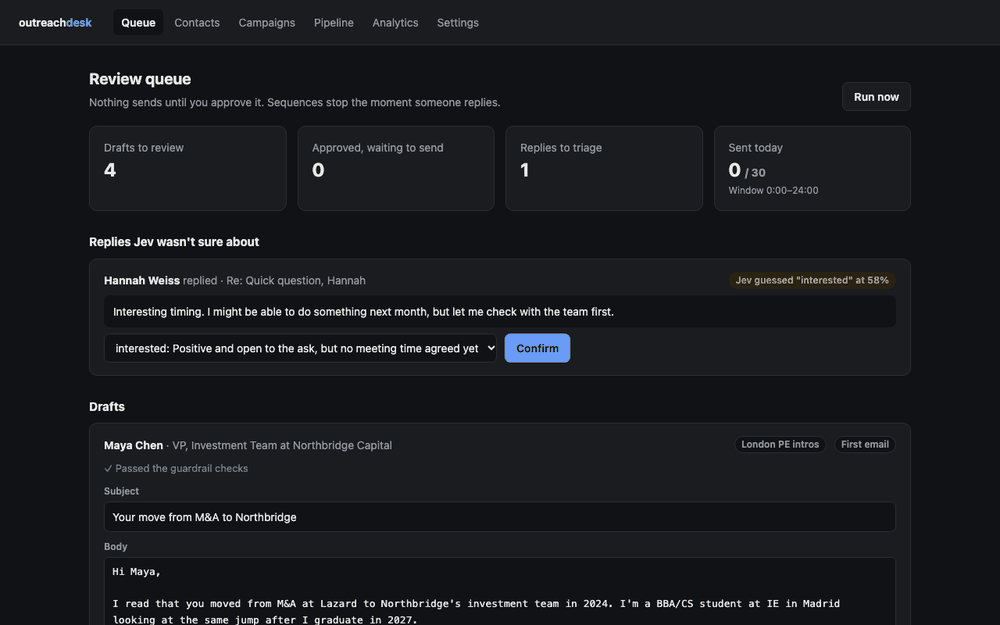
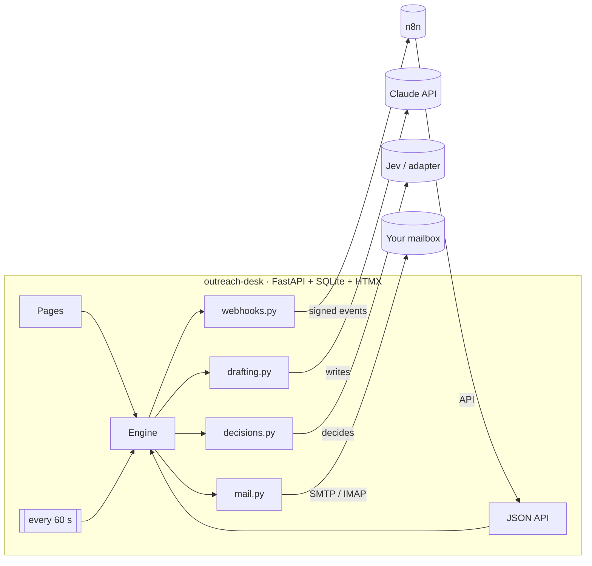

# outreach-desk

**A self-hosted outreach desk. Claude writes the emails, Jev makes the calls, you approve every send.**

Contacts, campaigns, follow-up sequences, reply triage, a pipeline board and analytics, in one
`pipx install`. It plugs into n8n, so leads can flow in from a Google Sheet and hot replies can
ping you on Slack.

[](https://github.com/owen-alderson/outreach-desk/actions/workflows/ci.yml)
[](https://pypi.org/project/outreach-desk/)
[](https://www.npmjs.com/package/n8n-nodes-outreach-desk)




<sub>Screenshots use fictional demo data.</sub>

## Why

Most cold-email tools either write generic text and blast it, or leave you doing everything by
hand. outreach-desk splits the work three ways:

| | Who | What |
|---|---|---|
| **Writes** | Claude (`claude-opus-5-5`) | First emails and follow-ups, personalised **only** from facts you gave it about the recipient |
| **Decides** | [Jev](https://typesafe.ai/blog/introducing-system-one-models-and-jev) (TypeSafe's System One model) | Typed, fast decisions with calibrated confidence: is this draft safe to send, how good a fit is this lead, what kind of reply is this |
| **Approves** | You | Nothing is ever sent until you approve that exact draft |

When Jev isn't confident, the decision goes to you instead of guessing.

## What it does

- **Contacts:** add by hand, import a CSV, or paste a LinkedIn bio and let Claude fill the form.
  Each contact has a *facts* field, and drafts may only personalise from those facts.
- **Campaigns:** two modes, **networking** (students and job-seekers writing to senior people)
  and **sales** (B2B), with a sequence like `0, 4, 7` (first email, then follow-ups 4 and 7 days later).
- **Review queue:** every draft arrives pre-checked by Jev. Edit, approve, regenerate or discard.
- **Sending:** through your own mailbox over SMTP, threaded properly (`In-Reply-To`/`References`),
  with a daily cap and a send window.
- **Replies:** IMAP sync. **Any reply stops the sequence immediately.** Jev labels each reply
  (`interested`, `meeting_request`, `referral`, `not_now`, `not_interested`, `out_of_office`,
  `unsubscribe`, `bounce`) and moves the contact along the pipeline. Unsubscribes and bounces go
  on a do-not-contact list. Out-of-office replies don't stop the sequence.
- **Pipeline board:** `new → contacted → replied → meeting → won / lost`.
- **Analytics:** reply rate and positive rate per campaign and per step, reply labels, and every
  decision logged with which backend answered and how long it took.
- **API + webhooks:** a bearer-key JSON API and HMAC-signed webhooks, used by the n8n node.

## Quickstart

```bash
pipx install outreach-desk
outreach-desk            # opens http://127.0.0.1:8000
```

Put your settings in `~/.outreach-desk/.env` (or a `.env` in the folder you run it from):

```bash
ANTHROPIC_API_KEY=sk-ant-...        # required: Claude writes the drafts
TYPESAFE_API_KEY=                   # optional: Jev makes the decisions (see below)

SMTP_HOST=smtp.gmail.com            # optional until you want to send
SMTP_PORT=587
SMTP_USER=you@example.com
SMTP_PASSWORD=your-app-password     # an app password, not your login password
IMAP_HOST=imap.gmail.com            # optional: reply sync
FROM_NAME=Your Name

DAILY_CAP=30
SEND_WINDOW=8-19                    # local hours
POSTAL_ADDRESS=                     # required for sales mode (CAN-SPAM footer)
```

Without SMTP settings you can still build contacts, campaigns and drafts; nothing will send.
See [.env.example](.env.example) for every option.

<details>
<summary>Docker / Docker Compose (with n8n)</summary>

```bash
docker compose up -d     # outreach-desk on :8000, n8n on :5678 (both localhost-only)
```

The compose file reads `.env` if present and keeps data in named volumes.
</details>

## How Jev is used

Jev is a *System One* model: you describe a decision as typed questions, and it answers each one
with a probability or a label plus its confidence (TypeSafe quotes 70–500 ms per call). outreach-desk asks three
sets of questions ([`decisions.py`](outreach_desk/decisions.py)):

| Decision | Questions | What happens |
|---|---|---|
| **Draft guardrail** | `Noul`: uses a cliché? claims something about the recipient that isn't in their facts? unclear ask? · `Score`: tone fit | Flags shown on the draft with their probability. Advice only: you still decide. A plain banned-phrase check runs too, so exact matches are never missed. |
| **Lead fit** | `Score` against the campaign's target · `Choice` seniority | Contacts sorted by fit |
| **Reply triage** | `Choice` over the 8 reply labels | ≥ 70% confidence: routed automatically. Below that: it waits in the queue for you, though the sequence still stops |

**No Jev key? It still works.** Without `TYPESAFE_API_KEY`, the same questions go to TypeSafe's
open-source [`system-one-adapter`](https://github.com/typesafe-ai/system-one-adapter-python),
which answers them with Claude Haiku 4.5 through the same interface. Expect it to be slower
(seconds, not milliseconds); the Analytics page shows which backend answered each decision and
how long it took, so you can compare.

## n8n

[`n8n-nodes-outreach-desk`](n8n-node/) adds two nodes to n8n:

- **Outreach Desk:** create, update or list contacts; enrol contacts in a campaign; list,
  approve (with edits) or reject drafts.
- **Outreach Desk Trigger:** starts a workflow on `draft.ready`, `email.sent`,
  `reply.classified` (optionally only for certain labels) or `contact.stage_changed`. It
  registers its own webhook when the workflow is activated, removes it when deactivated, and
  rejects any request without a valid signature.

Install it from **Settings → Community Nodes** in n8n. Ready-made workflows in
[`n8n/workflows/`](n8n/workflows/):

| Template | Flow |
|---|---|
| [sheet-to-campaign](n8n/workflows/sheet-to-campaign.json) | New Google Sheet row → contact → campaign |
| [hot-reply-to-slack](n8n/workflows/hot-reply-to-slack.json) | Interested / meeting / referral reply → Slack message |
| [won-to-hubspot](n8n/workflows/won-to-hubspot.json) | Contact moved to *won* → HubSpot contact |

## API

Every endpoint needs `Authorization: Bearer <key>` (the key is on the Settings page) except
`/api/health`.

| Method | Path | |
|---|---|---|
| `GET` | `/api/contacts?stage=` | List contacts |
| `POST` | `/api/contacts` | `{name, email, role?, company?, facts?}` |
| `PATCH` | `/api/contacts/{id}` | Any field, or `stage` |
| `GET` | `/api/campaigns` | List campaigns |
| `POST` | `/api/campaigns/{id}/enroll` | `{contact_ids?: [...], emails?: [...]}` |
| `GET` | `/api/drafts` | Drafts waiting for review |
| `POST` | `/api/drafts/{id}/approve` | `{subject?, body?}` |
| `POST` | `/api/drafts/{id}/reject` | Discards it and stops that contact's sequence |
| `POST` / `DELETE` | `/api/webhooks[/{id}]` | Subscribe `{url, events}`; the response includes the signing secret |

Webhook bodies are `{"event", "data", "sent_at"}` with
`X-Outreach-Signature: sha256=HMAC_SHA256(secret, raw_body)`.

## Safety rules

These are enforced in code and covered by tests:

- **Nothing sends without approval**, and an approved email that hasn't gone out yet is cancelled
  if the person replies first.
- **Daily cap and send window** for every mailbox.
- **Do-not-contact list:** unsubscribes, bounces and contacts you delete are never emailed again.
- **Sales mode** adds a postal address, an unsubscribe line and a `List-Unsubscribe` header.
- **Delete a contact** removes their data (right to erasure) and keeps only their address on the
  do-not-contact list.
- **The app listens on localhost** with no login, and refuses form posts coming from other
  websites. Don't expose it to the internet without putting authentication in front of it.

Deliverability tip: send from a secondary address or domain, warm it up, and keep the daily cap low.

## Architecture



`engine.py` holds the rules (enrol, draft what's due, send what's approved, route replies). Every
function takes a session and a clock, so it is fully testable without a network.

## Development

```bash
git clone https://github.com/owen-alderson/outreach-desk && cd outreach-desk
python -m venv .venv && . .venv/bin/activate
pip install -e '.[dev]'
pytest                    # 178 tests, no network: Claude, Jev, SMTP and IMAP are faked

cd n8n-node && npm install && npm run lint && npm run build
```

Releases: push `vX.Y.Z` to publish to PyPI, `n8n-vX.Y.Z` to publish the n8n node to npm (both
from GitHub Actions; the npm package carries a provenance statement).

The original single-email Streamlit version is kept at tag
[`v1-streamlit`](https://github.com/owen-alderson/outreach-desk/tree/v1-streamlit).

## License

MIT
